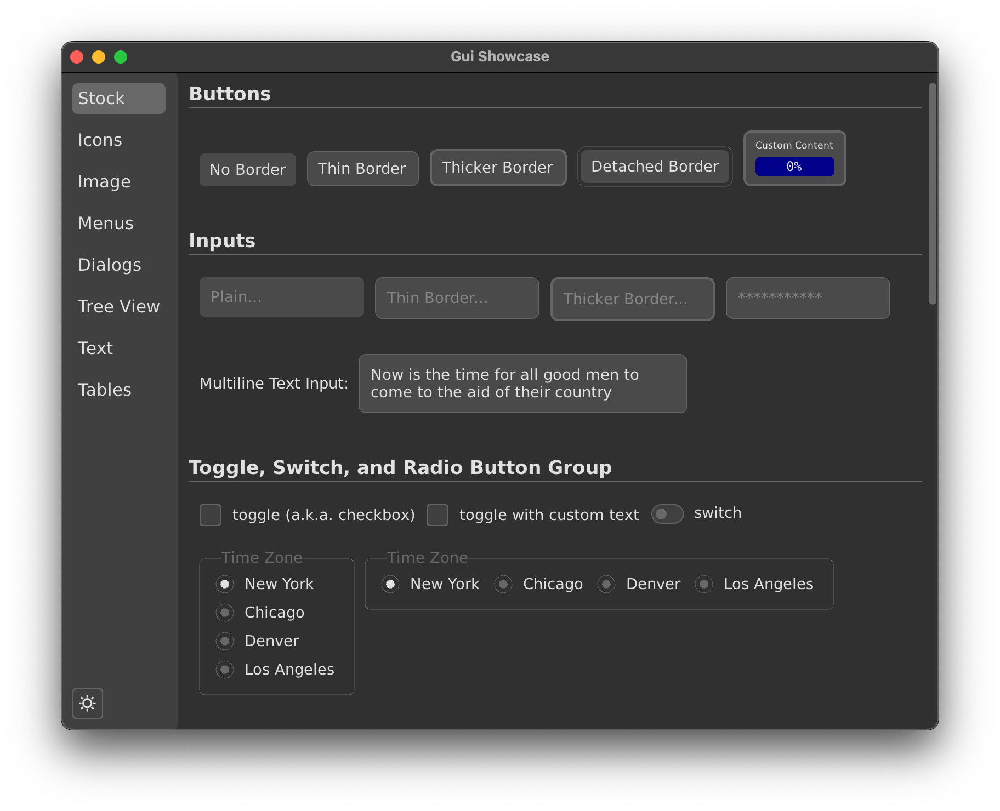

# GUI


**An immediate-mode UI framework for V that stays out of your way.**



## Motivation

Most UI frameworks want you to think about data binding, observables, and UI thread
synchronization. v-gui doesn't. Your view is just a function of your state—change the state
anywhere and the UI updates. No wiring. No callbacks to remember. No threading headaches.

The layout engine is inspired by [Clay](https://github.com/nicbarker/clay), a fast layout
algorithm that makes flex-box style layouts simple to reason about.

V is a simple language. It deserves a simple UI framework.

## Who Is This For?

**Good fit if you want:**
- State as plain structs, no observables
- Thread-safe UI updates from anywhere
- Code-defined layouts (no XML, no designers)
- Desktop apps, tools, data viewers, games

**Maybe not if you need:**
- Mature accessibility support (work in progress)
- Production mobile apps
- Native platform widgets
- Drag-and-drop UI designers

## Features

**Layout**
- Flex-box rows and columns
- Fit/fill/fixed sizing per axis
- Scroll containers with momentum
- Nested layouts to any depth

**Widgets (30+)**
- Text, inputs, textareas
- Buttons, toggles, switches, checkboxes, radio buttons
- Dropdowns, listboxes, tables, trees, markdown
- Menus, menubars, tabs, dialogs
- Progress bars, tooltips, date pickers
- Native open/save/folder dialogs (macOS + Linux)

**Rendering**
- SDF-based drop shadows
- Linear and radial gradients
- Blur effects
- Custom fragment shaders (Metal + GLSL)
- Full SVG support (paths, transforms, groups, strokes)
- Mermaid diagram rendering

**Animation**
- Tweens with easing curves
- Physics-based springs
- Automatic layout transitions
- Hero morphs between views

**Text** (via vglyph/Pango)
- Subpixel positioning and hinting
- Rich text with mixed styles in a single widget
- Bidirectional text, ligatures, emoji
- Full Unicode and OpenType support
- IME support for CJK and other complex input methods

**Architecture**
- Thread-safe state updates
- 60 FPS with 1000+ widgets
- Pure V, no C bindings in user code

## Quick Start

```v ignore
import gui

@[heap]
struct App {
pub mut:
	clicks int
}

fn main() {
	mut window := gui.window(
		state: &App{}
		on_init: fn (mut w gui.Window) { w.update_view(main_view) }
	)
	window.run()
}

fn main_view(window &gui.Window) gui.View {
	app := window.state[App]()
	return gui.column(
		h_align: .center
		v_align: .middle
		content: [
			gui.text(text: '${app.clicks} clicks'),
			gui.button(
				content: [gui.text(text: 'Click me')]
				on_click: fn (_, _, mut w gui.Window) {
					w.state[App]().clicks += 1
				}
			),
		]
	)
}
```

See [GET_STARTED.md](docs/GET_STARTED.md) for a detailed walkthrough.

## Installation

```bash
v install gui
```

## Dependencies

| Package | Purpose | Source |
|---------|---------|--------|
| `vglyph` | Text rendering | Auto-installed with v-gui |
| `gg` | 2D graphics | V standard library |
| `sokol.sapp` | Windowing and events | V standard library |

## Documentation

| Document | Description |
|----------|-------------|
| [GET_STARTED.md](docs/GET_STARTED.md) | Tutorial: first app to working knowledge |
| [ARCHITECTURE.md](docs/ARCHITECTURE.md) | How v-gui works under the hood |
| [LAYOUT_ALGORITHM.md](docs/LAYOUT_ALGORITHM.md) | Sizing, alignment, and positioning |
| [ANIMATIONS.md](docs/ANIMATIONS.md) | Tweens, springs, and transitions |
| [SVG.md](docs/SVG.md) | Vector graphics and icon rendering |
| [MARKDOWN.md](docs/MARKDOWN.md) | Markdown rendering |
| [TABLES.md](docs/TABLES.md) | Table widget and data display |
| [GRADIENTS.md](docs/GRADIENTS.md) | Linear and radial gradients |
| [SHADERS.md](docs/SHADERS.md) | Custom fragment shaders |
| [PRINTING.md](docs/PRINTING.md) | PDF export and native print dialog |

Generate API docs with:
```bash
v run _doc.vsh
```

## Examples

The `examples/` folder contains working apps for every feature:

```bash
v run examples/get_started.v    # Start here
v run examples/buttons.v        # Button variants
v run examples/animations.v     # Tweens and springs
v run examples/theme_designer.v # Build custom themes
v run examples/tiger.v          # SVG rendering demo
v run examples/markdown.v       # Markdown rendering
v run examples/dialogs.v        # Custom + native dialogs
v run examples/printing.v       # PDF export + native print
v run examples/input_masks.v    # Input mask presets and custom tokens
v run examples/table_demo.v     # Table widget demo
v run examples/custom_shader.v  # Custom fragment shaders
v run examples/snake.v          # A complete game
```

## Status

v-gui is in active development. Join the discussion on
[Discord](https://discord.com/channels/592103645835821068/665558664949530644).

## Contributing

Contributions welcome:
- Report bugs and request features via GitHub issues
- Submit pull requests
- Improve documentation

## License

MIT
