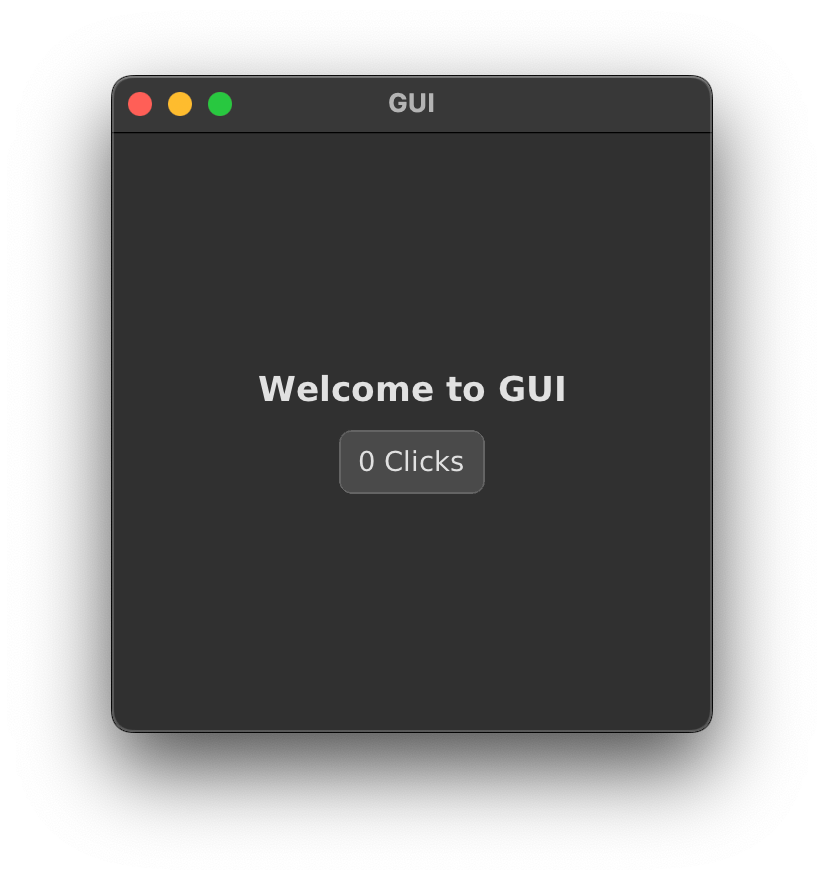
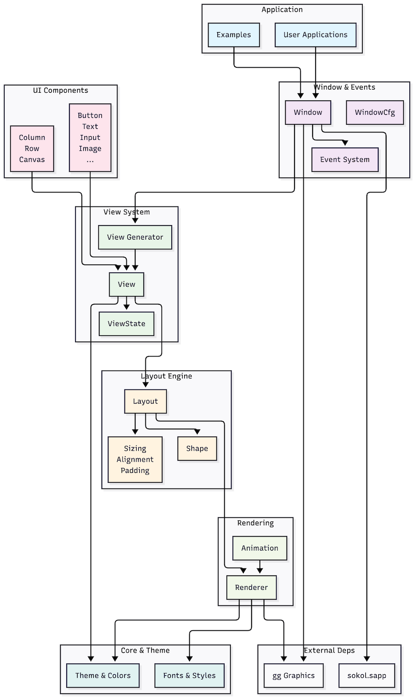

# GUI    

## Overview

V GUI is an immediate mode UI framework for the V programming language
based on the rendering algorithm of Clay. It provides a modern,
declarative approach to building user interfaces with flex-box style
layout syntax and thread-safe view updates.


## Key Features

  - **Pure V**: Written entirely in the V programming language
  - **Immediate Mode Rendering**: Efficient rendering with automatic
    updates
  - **Thread Safe**: Safe view updates across different threads
  - **Declarative Syntax**: Flex-box style layout with intuitive API
  - **Performance Focused**: Optimized for speed and efficiency

## Installation

Install the GUI framework using V’s package manager:

``` bash
v install gui
```

## Core Concepts

### View Generators

GUI uses a view generator (a function that returns a View) to render the
contents of the Window. As the state of the app changes, either through
user actions or business logic, GUI calls the view generator to build a
new view.

### State Management

The framework follows a functional approach where: 

  - The view is simply a function of the model (state) 
  - No data binding or other observation  mechanisms required 
  - No worries about synchronizing with the UI thread 
  - No need to remember to undo previous UI states

## Basic Usage

### Creating a Simple Application

Here’s a complete example of a basic GUI application:

``` v
import gui

struct App {
pub mut:
    clicks int
}

fn main() {
    mut window := gui.window(
        state: &App{}
        width: 300
        height: 300
        on_init: fn (mut w gui.Window) {
            // Call update_view() anywhere in your
            // business logic to change views.
            w.update_view(main_view)
        }
    )
    window.run()
}

// The view generator set in update_view() is called on
// every user event (mouse move, click, resize, etc.).
fn main_view(window &gui.Window) gui.View {
    w, h := window.window_size()
    app := window.state[App]()
    return gui.column(
        width: w
        height: h
        h_align: .center
        v_align: .middle
        sizing: gui.fixed_fixed
        content: [
            gui.text(text: 'Welcome to GUI'),
            gui.button(
                content: [gui.text(text: '${app.clicks} Clicks')]
                on_click: fn (_ &gui.ButtonCfg, mut e gui.Event, mut w gui.Window) {
                    mut app := w.state[App]()
                    app.clicks += 1
                }
            ),
        ]
    )
}
```



## Core Components

### Window

The `gui.window()` function creates the main application window with the
following parameters:

  - `state`: Application state object
  - `width`: Window width in pixels
  - `height`: Window height in pixels
  - `on_init`: Initialization callback function

### Layout Components

#### Column Layout

``` v
gui.column(
    width: w
    height: h
    h_align: .center    // Horizontal alignment
    v_align: .middle    // Vertical alignment
    sizing: gui.fixed_fixed
    content: [
        // Child components
    ]
)
```

### UI Elements

#### Text

``` v
gui.text(text: 'Your text here')
```

#### Button

``` v
gui.button(
    content: [gui.text(text: 'Button Text')]
    on_click: fn (_ &gui.ButtonCfg, mut e gui.Event, mut w gui.Window) {
        // Handle click event
    }
)
```

## Event Handling

Events are handled through callback functions passed to UI components.
The event system provides:

  - Mouse events (click, move, etc.)
  - Keyboard events
  - Window events (resize, etc.)

Event handlers receive: 

  - Component configuration 
  - Event object 
  - Window reference for state access

## State Management

### Accessing State

``` v
fn view_function(window &gui.Window) gui.View {
    app := window.state[App]()  // Get typed state
    // Use app state in view
}
```

### Updating State

``` v
on_click: fn (_ &gui.ButtonCfg, mut e gui.Event, mut w gui.Window) {
    mut app := w.state[App]()  // Get mutable state reference
    app.clicks += 1            // Modify state
    // View automatically updates
}
```

## Layout System

The framework uses a flex-box inspired layout system with:

### Alignment Options

  - **Horizontal alignment**: `.left`, `.center`, `.right`
  - **Vertical alignment**: `.top`, `.middle`, `.bottom`

### Sizing Options

  - `gui.fixed_fixed`: Fixed width and height
  - Additional sizing modes available

## Building and Running

The README.md in the examples folder describes how to build GUI
programs. Don’t fret, it’s a one-liner.

To build a GUI application:

``` bash
v run your_app.v
```

## Examples

### Getting Started

If you’re new to GUI, start with the get-started.v example. It explains
the basics of view generators, state models and event handling.

### Available Examples

  - `get-started.v` - Basic introduction
  - `two-panel.v` - Two-panel layout example
  - `test-layout.v` - Layout engine testing
  - `doc_viewer.v` - Documentation viewer

## Documentation

### Generated Documentation

The Makefile at the root of the project builds documentation from the
source code. Type make doc to produce the documentation and make read to
open the documentation in the browser.

``` bash
make doc   # Generate documentation
make read  # Open documentation in browser
```

### Manual Documentation

There is also some hand written documentation in the `/doc folder` labeled
`01 Introduction.md`, `02 Getting Started.md`, etc. The `doc_viewer.v` example
can be used to read them or use a browser.

## Architecture Overview



The `gui` project follows a layered architecture, ensuring a clear separation of concerns.
Here's a breakdown of its main parts and their interactions:

### **Application Layer**
This layer represents the entry points for users and developers.
*   **Application Code**: These are the actual user applications built using the `gui` library.
*   **Examples**: A collection of demonstration applications showcasing various features and usage patterns of the `gui` framework.

### **Window Management Layer**
This layer handles the main application window and user interactions.
*   **Window**: The central orchestrator of the GUI system, managing the application window.
*   **WindowCfg**: Configuration parameters used during the creation of a window, such as dimensions, title, and initial callbacks.
*   **Event System**: Responsible for capturing and processing all user input events, including mouse actions, keyboard presses, and window-specific events like resizing.

### **View Layer**
This layer defines the UI elements and how they are generated.
*   **View**: An abstract representation of UI components and their layouts. Views are stateless and generate layouts.
*   **View Generator**: Functions that dynamically create `View` instances based on the application's current state.
*   **ViewState**: Manages the transient state of views, such as focus, selection, and scroll positions, which are not stored directly within the stateless `View` objects.

### **Layout Engine**
This is the core system for arranging and positioning UI elements.
*   **Layout**: A hierarchical tree structure that defines the arrangement of UI elements on the screen. It's generated from `View`s.
*   **Shape**: The fundamental geometric representation of any UI element, holding properties like position, size, and styling.
*   **Sizing, Alignment, Padding**: These modules control how elements are dimensioned, positioned relative to each other, and how spacing is applied around them, respectively.

### **UI Components**
This layer provides a rich set of pre-built UI elements for common use cases.
*   **Common Components**: Includes basic interactive elements like `Button`, `Text`, `Input`, `Image`, and more specialized widgets.
*   **Containers**: Layout-specific components such as `Column`, `Row`, and `Canvas` that organize child elements.

### **Rendering System**
This layer is responsible for the actual drawing of UI elements onto the screen.
*   **Renderer**: The component that takes the processed `Layout` information and translates it into drawing instructions.
*   **Animation**: Handles animated UI elements, providing smooth transitions and visual feedback.

### **Core Systems**
These are foundational utilities and styling mechanisms.
*   **Theme & Colors**: Manages the visual styling of the entire application, including color palettes and overall theme settings.
*   **Fonts & Styles**: Provides text rendering capabilities, including font loading, variants (bold, italic, mono), and text styling options.

### **External Dependencies**
These are external libraries that the `gui` project relies on.
*   **gg Graphics**: A graphics library used for low-level 2D rendering operations.
*   **sokol.sapp**: A cross-platform application framework that provides windowing and event handling functionalities.

The overall flow begins with user applications creating a `Window`. The `Window` then uses
`View Generators` to produce `View`s, which are transformed into `Layout`s by the
`Layout Engine`. Finally, the `Rendering` system draws these `Layout`s using `gg Graphics`
and `sokol.sapp`, adhering to the defined `Theme` and `Fonts`.

## Development Status

Current state of the project can be found at: [Progress Reports and
Feedback](https://github.com/mike-ward/gui/issues/3)

## Best Practices

1.  **Keep views pure**: View functions should only depend on the
    provided state
2.  **Handle state changes in event handlers**: Modify state in click
    handlers and other event callbacks
3.  **Use declarative layouts**: Leverage the flex-box style layout
    system
4.  **Start simple**: Begin with basic examples and gradually add
    complexity

## Troubleshooting

Since the framework is in early development:

- Check the GitHub issues for known problems
- Refer to working examples for proper usage patterns
- Provide feedback to help improve the framework

## Contributing

The project welcomes contributions and feedback. Visit the GitHub
repository to:

- Report issues
- Submit pull requests
- Provide feedback  on the framework design
- Help with documentation

## Related Projects

V also provides other UI solutions:

- **V UI**: Cross-platform widget toolkit
- **gg**: Graphics library for 2D applications using OpenGL/Metal/DirectX 11

This GUI framework focuses specifically on immediate mode rendering with
a declarative API, making it distinct from other V UI solutions.

