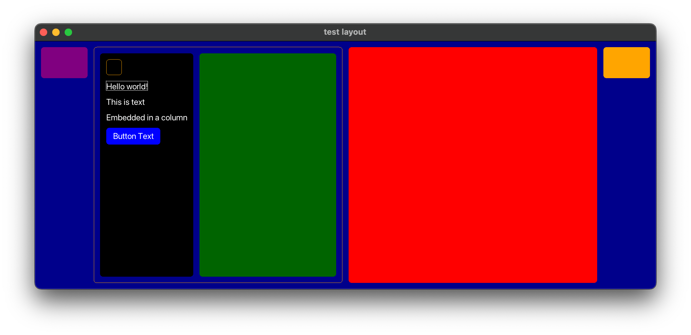

# GUI

A UI frame work for the V language based on the rendering algorithm of Clay.

It's early days so very little is working. Try it and send me feedback.

## Features

- Pure V (so far...)
- Immediate mode rendering
- Thread safe view updates
- Declarative layout syntax
- flex-box style layout (rows, columns, etc.)
- Automatic clipping. Controls won't draw outside their containers.
- Microsecond performance

## Example
```v
module main

import gui
import gx

@[heap]
struct AppState {
pub mut:
	click_count int
}

fn main() {
	mut window := gui.window(
		title:      'test layout'
		width:      600
		height:     400
		bg_color:   gx.rgb(0x30, 0x30, 0x30)
		state:      &AppState{}
		on_init:    fn (mut w gui.Window) {
			w.update_view(main_view(w))
		}
		on_resized: fn (mut w gui.Window) {
			w.update_view(main_view(w))
		}
	)
	window.run()
}

fn main_view(w &gui.Window) gui.View {
	width, height := w.window_size()
	mut state := w.get_state[AppState]()

	return gui.row(
		width:    width
		height:   height
		sizing:   gui.fixed_fixed
		fill:     true
		color:    gui.dark_blue
		children: [
			gui.column(
				padding:  gui.padding_none
				sizing:   gui.fit_flex
				children: [
					gui.rectangle(
						width:  75
						height: 50
						fill:   true
						color:  gui.purple
					),
					gui.rectangle(
						width:  75
						height: 50
						sizing: gui.fit_flex
						color:  gui.transparent
					),
					gui.rectangle(
						width:  75
						height: 50
						fill:   true
						color:  gui.green
					),
				]
			),
			gui.row(
				id:       'orange'
				color:    gui.orange
				sizing:   gui.Sizing{.flex, .flex}
				children: [
					gui.column(
						sizing:   gui.Sizing{.flex, .flex}
						fill:     true
						color:    gui.rgb(0x30, 0x30, 0x30)
						children: [
							gui.rectangle(
								width:  25
								height: 25
								color:  gui.orange
							),
							gui.column(
								color:    gx.white
								children: [
									gui.label(text: 'Hello world!'),
								]
							),
							gui.label(text: 'This is text'),
							gui.label(
								id:       'label'
								wrap:     true
								text_cfg: gx.TextCfg{
									size:  18
									color: gui.white
								}
								text:     'Embedded in a column with wrapping'
							),
							gui.button(
								text:     'Button Text ${state.click_count}'
								on_click: fn (id string, me gui.MouseEvent, mut w gui.Window) {
									mut state := w.get_state[AppState]()
									state.click_count += 1
									w.update_view(main_view(w))
								}
							),
						]
					),
					gui.rectangle(
						id:     'green'
						width:  25
						height: 25
						fill:   true
						sizing: gui.flex_flex
						color:  gui.dark_green
					),
				]
			),
			gui.rectangle(
				width:  75
				height: 50
				fill:   true
				sizing: gui.flex_flex
				color:  gx.red
			),
			gui.column(
				padding:  gui.Padding{0, 0, 0, 0}
				sizing:   gui.fit_flex
				children: [
					gui.rectangle(
						width:  75
						height: 50
						fill:   true
						color:  gui.orange
					),
					gui.rectangle(
						width:  75
						height: 50
						sizing: gui.fit_flex
						color:  gui.transparent
					),
					gui.rectangle(
						width:  75
						height: 50
						fill:   true
						color:  gui.yellow
					),
				]
			),
		]
	)
}
````


## Description

GUI is a fast, nimble UI framework for the V programming language. It aspires to be
a useful framework without requiring a long learning curve.

## Roadmap

I plan to create a capable, robust and fairly complete UI framework. As to timelines,
who knows. I'm making this up as I go along. Currently, this is really the only project
I'm working on so you should expect frequent updates.