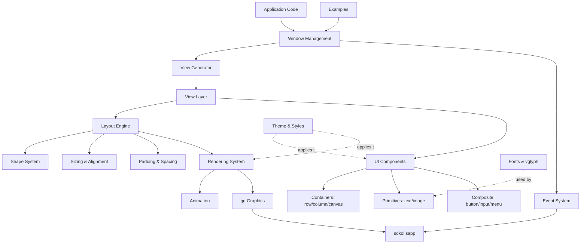
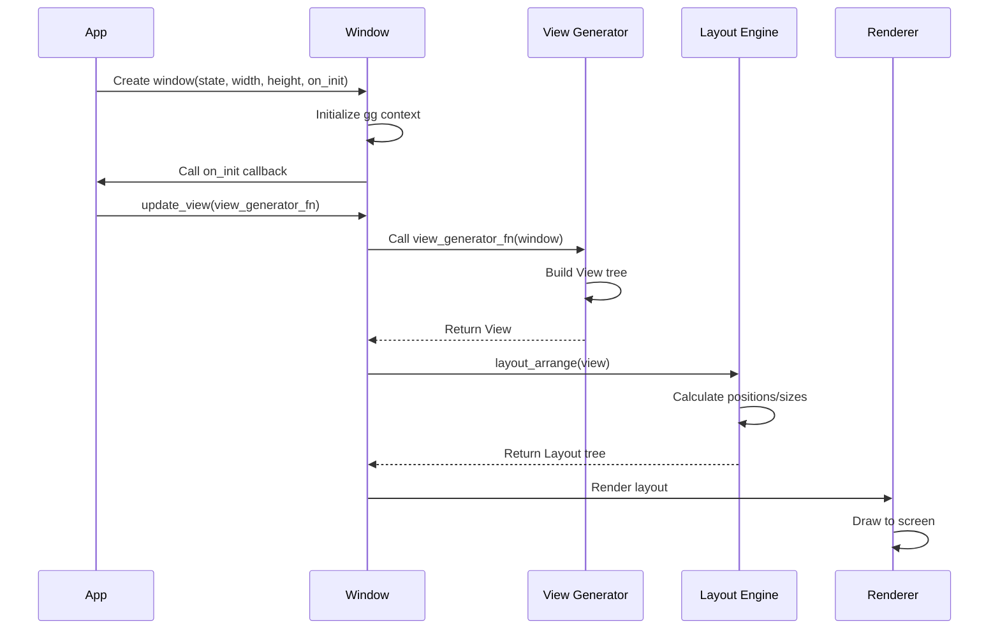
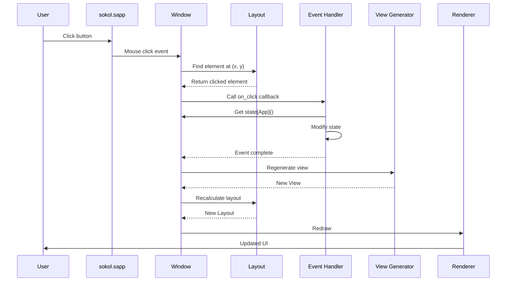
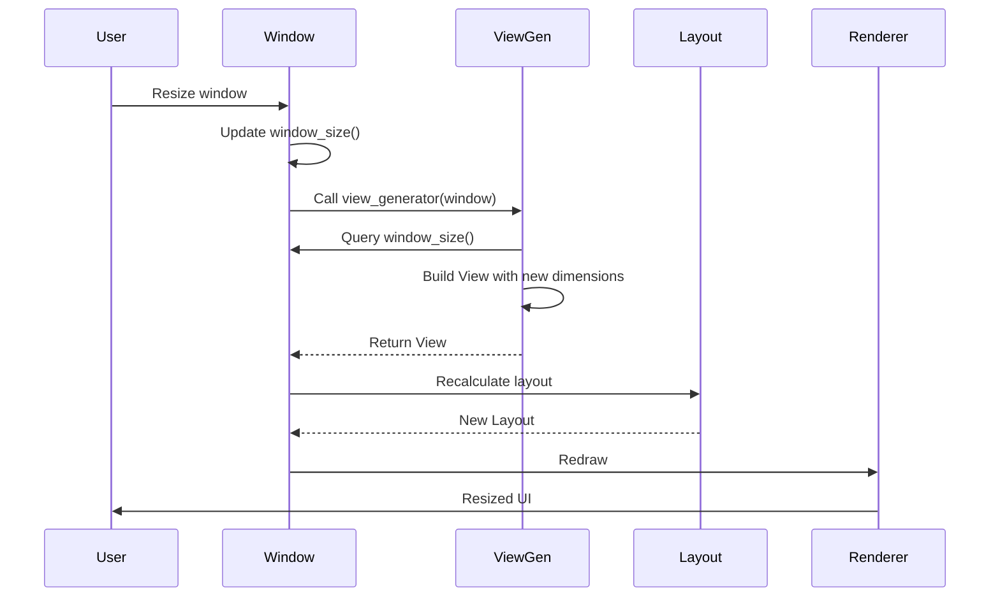

# Architecture

v-gui follows a layered architecture with clear separation of concerns.
This document explains the system design, data flow, and key architectural
decisions.

## High-Level Overview

## System Layers

### Application Layer

Entry point for developers using v-gui.

- **Application Code**: Programs built with v-gui
- **Examples**: Demonstration applications showcasing features

### Window Management Layer

Manages the application window and orchestrates the system.

**Window**: Central coordinator that:
- Holds application state
- Manages view generator functions
- Processes events
- Triggers view regeneration
- Provides window size and configuration

**Event System**: Captures user input:
- Mouse events (move, click, drag)
- Keyboard events (press, release)
- Window events (resize, focus, close)

### View Layer

Defines UI structure through pure functions.

**View**: Stateless UI description that generates layouts. Views are
ephemeral - they exist only during layout calculation.

**View Generator**: Function with signature `fn(window &Window) View` that
creates views based on current state.

**ViewState**: Manages transient UI state not stored in application state:
- Focus state
- Selection ranges
- Scroll positions
- Hover state

### Layout Engine

Transforms views into positioned, sized elements.

**Layout**: Hierarchical tree of positioned UI elements. The layout engine:
1. Removes floating layouts for separate processing
2. Calculates widths (horizontal pass)
3. Calculates heights (vertical pass)  
4. Distributes fill space
5. Applies alignment
6. Positions floating layouts

**Shape**: Geometric representation of UI elements:
- Position (x, y)
- Size (width, height)
- Padding
- Color and fill
- Radius (rounded corners)
- Clipping

**Sizing**: Three modes per axis:
- `fit`: Size to content
- `fill`: Grow/shrink to fill parent
- `fixed`: Use specified size

**Alignment**: Controls position within parent:
- Horizontal: left, center, right
- Vertical: top, middle, bottom

**Padding**: Inner margin (top, right, bottom, left)

### UI Components

Pre-built, composable UI elements.

**Containers**:
- `row`: Horizontal stacking (left-to-right axis)
- `column`: Vertical stacking (top-to-bottom axis)
- `canvas`: Free-form positioning (no axis)
- `container`: Generic container with scrolling

**Primitives**:
- `text`: Text rendering via vglyph
- `image`: Bitmap display

**Composite Components**: Built from primitives:
- `button`, `toggle`, `switch`: Interactive buttons
- `input`, `select`: Text entry
- `menu`, `menubar`: Navigation
- `dialog`, `tooltip`: Overlays
- `progress_bar`, `pulsar`: Indicators
- `listbox`, `table`, `tree`: Data display
- Many more (28 total)

### Rendering System

Draws the layout to screen.

**Renderer**: Translates layout tree into drawing commands:
- Fills rectangles with colors/gradients
- Draws borders and rounded corners
- Renders text (delegates to vglyph)
- Displays images
- Applies clipping

**Animation**: Handles animated elements with smooth transitions.

### Core Systems

**Theme & Styles**: Visual styling:
- `Theme`: Complete style configuration
- `ThemeCfg`: Compact theme definition
- Per-component style structs (ButtonStyle, InputStyle, etc.)
- Color palette
- Built-in themes: dark, light, bordered variants

**Fonts & vglyph**: Text rendering:
- Font loading and management
- Text shaping and layout (via vglyph)
- TextStyle: family, size, color, properties
- Built-in presets (n1-n6, b1-b6, i1-i6, m1-m6)

### External Dependencies

- **gg Graphics**: 2D rendering library (OpenGL/Metal/DirectX backends)
- **sokol.sapp**: Cross-platform windowing and events
- **vglyph**: Advanced text rendering with Pango integration

## Data Flow

### Initialization

### Event Handling

### Window Resize

## Key Architectural Decisions

### Immediate Mode Rendering

v-gui regenerates the entire UI on every update rather than maintaining
persistent widget objects.

**Benefits**:
- Eliminates synchronization bugs
- No need to "undo" previous state
- Views are pure functions of state
- Simpler mental model
- Easier to reason about

**Performance**: Layout calculation is optimized to run in microseconds,
not milliseconds. Regenerating thousands of times per second is feasible.

### Stateless Views

Views are ephemeral descriptions, not stateful objects. They exist only
during layout calculation.

**Benefits**:
- Predictable: View is always function of state
- No stale state bugs
- Easy to test (pure functions)
- Thread-safe

**Transient State**: Managed separately in ViewState for things like focus,
selection, scroll position that don't belong in application state.

### Two-Pass Layout

Layout calculation runs in multiple passes:
1. Width calculation
2. Fill width distribution
3. Height calculation
4. Fill height distribution
5. Positioning

**Why**: Separating axes simplifies the algorithm. Fill distribution
requires knowing fixed sizes first.

### Floating Layouts

Elements with `float: true` are removed from normal flow and positioned
absolutely after main layout completes.

**Use Cases**: Tooltips, dialogs, context menus that overlay other content.

### Flex-Box Inspired Layout

Uses rows (horizontal) and columns (vertical) with fit/fill/fixed sizing
rather than absolute positioning.

**Benefits**:
- Responsive to window size changes
- DPI-independent
- Familiar to web developers
- Less code than absolute positioning

### Theme System

Centralized styling via `Theme` struct applied to all components.

**Benefits**:
- Consistent look across app
- Easy theme switching
- Override per-component when needed
- `theme_maker` generates complete themes from compact config

## Performance Characteristics

### Layout Calculation

- **Typical time**: < 1ms for hundreds of elements
- **Complexity**: O(n) where n = number of views
- **Optimization**: Early exit when sizes don't change

### Rendering

- **Backend**: Hardware-accelerated (OpenGL/Metal/DirectX)
- **Batching**: gg batches similar draw calls
- **Clipping**: Skips rendering of clipped elements

### Text Rendering

- **vglyph**: Uses Pango for complex text layout
- **Caching**: Glyph atlas caching
- **Shaping**: Handles bidirectional text, ligatures, etc.

### Memory

- **Views**: Allocated per frame, short-lived
- **Layouts**: Reused when possible
- **State**: User-controlled, persistent

## Platform Independence

v-gui runs on many of the platforms V supports:

- **Graphics**: gg abstracts OpenGL/Metal/DirectX
- **Windowing**: sokol.sapp handles platform-specific windowing
- **Events**: Cross-platform event abstraction
- **Text**: vglyph works on many platforms

