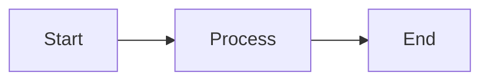

# Markdown Support

v-gui includes a markdown view component that parses markdown source and renders it as styled rich
text. Markdown is parsed once, cached, and rendered efficiently using the RTF infrastructure.

## Basic Usage

```v ignore
// Render markdown in a scrollable container
gui.column(
    id_scroll: 1
    content: [
        window.markdown(
            source: '# Hello\n\nThis is **bold** and *italic* text.'
        ),
    ]
)

// With custom styling
window.markdown(
    source: markdown_text
    style: gui.MarkdownStyle{
        code_block_bg: gui.rgb(40, 44, 52)
        h1_separator: true
    }
    mode: .wrap
    padding: gui.theme().padding_medium
)
```

## Supported Elements

### Block Elements

| Element          | Syntax                        | Notes                                   |
|------------------|-------------------------------|-----------------------------------------|
| Headers          | `# H1` through `###### H6`    | Optional separator lines via style      |
| Paragraphs       | Blank line separation         | Auto-wrapping                           |
| Unordered lists  | `- item` or `* item`          | Nested with indentation                 |
| Ordered lists    | `1. item`                     | Auto-numbered                           |
| Task lists       | `- [x] done` / `- [ ] todo`   | Checkbox rendering                      |
| Code blocks      | Triple backticks              | Language hint supported                 |
| Blockquotes      | `> text`                      | Nested quotes supported                 |
| Horizontal rules | `---` or `***`                | Full-width line                         |
| Tables           | Pipe syntax                   | Column alignment supported              |
| Images           | ``                | PNG/JPG via `image()`, SVG via `svg()`  |
| Mermaid diagrams | ` ```mermaid ` fence          | Async via Kroki API                     |

### Inline Elements

| Element       | Syntax                   | Notes             |
|---------------|--------------------------|-------------------|
| Bold          | `**text**` or `__text__` |                   |
| Italic        | `*text*` or `_text_`     |                   |
| Bold italic   | `***text***`             | Combined styling  |
| Strikethrough | `~~text~~`               |                   |
| Inline code   | `` `code` ``             | Monospace styling |
| Links         | `[text](url)`            | Clickable         |

## Extended Features

### Footnotes

```markdown
Here's a sentence with a footnote[^1].

[^1]: This is the footnote content.
```

### Definition Lists

```markdown
Term
:   Definition for the term.
```

### Abbreviations

```markdown
The HTML specification is maintained by the W3C.

*[HTML]: Hyper Text Markup Language
*[W3C]: World Wide Web Consortium
```

### Images

```markdown


```
SVG files render via `svg()` with auto-detected dimensions. Other formats (PNG, JPG) use `image()`.

#### Image Dimensions

Specify dimensions using `=WxH` syntax after the path:

```markdown
      // width=100, height=50
       // square 32x32
      // width=200, auto height
       // auto width, height=150
             // auto dimensions (default)
```


### Mermaid Diagrams

Render mermaid diagrams using fenced code blocks:



Diagrams are rendered asynchronously via the [Kroki](https://kroki.io) API.

**Configuration:**
- `mermaid_width: int = 500` - max diagram width (auto-scaled if wider)

**Notes:**
- Requires network connection
- Diagram source sent to external kroki.io API
- Supports all mermaid diagram types (flowcharts, sequence, class, state, gantt, etc.)
- Shows loading indicator during fetch
- Cached to avoid re-fetching (max 50 diagrams)

## Styling

`MarkdownStyle` controls all visual aspects of rendered markdown:

```v ignore
pub struct MarkdownStyle {
pub:
    // Text styles for different elements
    text               TextStyle  // body text
    h1                 TextStyle  // through h6
    bold               TextStyle
    italic             TextStyle
    bold_italic        TextStyle
    code               TextStyle  // inline code

    // Colors
    code_block_bg      Color      // code block background
    hr_color           Color      // horizontal rule
    link_color         Color      // link text
    blockquote_border  Color      // left border
    blockquote_bg      Color      // background

    // Spacing
    block_spacing      f32        // between blocks (default: 8)
    nest_indent        f32        // per nesting level (default: 16)
    prefix_char_width  f32        // list prefix column width

    // Code blocks
    code_block_padding Padding
    code_block_radius  f32

    // Header separators
    h1_separator       bool       // line under h1
    h2_separator       bool       // line under h2

    // Table styling (see TABLES.md for details)
    table_border_style TableBorderStyle
    table_border_color Color
    table_border_size  f32
    table_head_style   TextStyle
    table_cell_style   TextStyle
    table_cell_padding Padding
    table_row_alt      ?Color
}
```

### Custom Styles Example

```v ignore
custom_style := gui.MarkdownStyle{
    code_block_bg: gui.rgb(40, 44, 52)
    h1_separator: true
    h2_separator: true
    block_spacing: 12
    table_border_style: .horizontal
}

window.markdown(
    source: content
    style: custom_style
)
```

## Caching

Parsed markdown is cached by source hash to avoid re-parsing on every frame:

```v ignore
// Same source = cache hit, no re-parsing
window.markdown(source: same_text)  // parses
window.markdown(source: same_text)  // cache hit

// Different source = new cache entry
window.markdown(source: different_text)  // parses
```

The cache is managed automatically as part of `view_state.markdown_cache`. For dynamic content that
changes frequently, consider caching the source string itself rather than regenerating it each
frame.

## Examples

### Basic Document

```v ignore
fn main_view(window &gui.Window) gui.View {
    return gui.column(
        id_scroll: 1
        sizing: gui.fill_fill
        padding: gui.theme().padding_large
        content: [
            window.markdown(
                source: r"# Welcome

This is a **markdown** document with:
- Bullet points
- *Italic* text
- `inline code`

> And blockquotes too!
"
            ),
        ]
    )
}
```

### Styled Code Blocks

```v ignore
window.markdown(
    source: document
    style: gui.MarkdownStyle{
        code_block_bg: gui.rgb(40, 44, 52)
        code_block_padding: gui.padding(12, 12, 12, 12)
        code_block_radius: 6
    }
    color: gui.theme().color_panel
    radius: gui.theme().radius_medium
    padding: gui.theme().padding_medium
)
```

### Full Example

See `examples/markdown.v` for a complete demonstration including:
- All supported markdown elements
- Custom styling
- Scrollable container setup
- Theme integration

## Limitations

Currently not supported:
- HTML tags within markdown
- Custom link handlers (links are display-only)
- Syntax highlighting in code blocks (renders as monospace text)
- LaTeX/math expressions
- Embedded videos

For documents requiring these features, consider using a webview or rendering to HTML externally.

## Performance Tips

1. **Cache source strings**: If generating markdown dynamically, cache the generated string to
   benefit from the parse cache.

2. **Use wrap mode**: `mode: .wrap` allows text to reflow, reducing horizontal scrolling needs.

3. **Limit document size**: Very large documents render fine but may use more memory. Consider
   pagination for documents over 10,000 lines.
